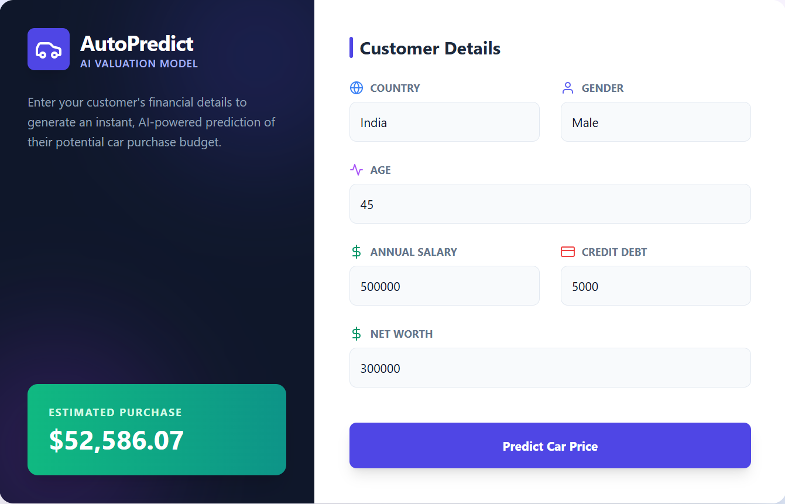

# 🚗 Car Price Predictor

### 💰 Predict Used Car Prices Using Machine Learning

🌐 **Live Application (Vercel)**
👉 **[https://carprice-2nj6.vercel.app/](https://carprice-2nj6.vercel.app/)**

---

## 🎥 Demo

<p align="center">
  
</p>

---

## 🧠 What is this project?

**Car Price Predictor** is a **full-stack machine learning web application** that estimates the **market price of a used car** based on its specifications.

This project mirrors **real-world automotive pricing systems** used by dealerships and online marketplaces by combining:

* A **regression-based ML model**
* A **FastAPI backend**
* A **modern React + Tailwind frontend**
* **Dockerized deployment-ready backend**

The app delivers **instant, data-driven price predictions** through a clean and responsive UI.

---

## ✨ Key Features

* 🚘 **Used car price prediction**
* 📈 **Machine learning regression model**
* ⚡ **Real-time inference via REST API**
* 🖥️ **Modern React + Tailwind frontend**
* 🔗 **Frontend–backend integration**
* 🐳 **Dockerized backend**
* ☁️ **Cloud-deployed frontend**
* 📱 **Fully responsive UI**
* 🧩 **Production-style project structure**

---

## 🛠️ Tech Stack

## 🛠️ Tech Stack

### Frontend

<p>
  
  
  
  
</p>

### Backend & ML

<p>
  
  
  
  
  
</p>

### Tools & Platform

<p>
  
  
  
</p>

---

## 📊 Problem Statement

Determining the **right price for a used car** is challenging due to multiple influencing factors such as:

* Brand & model
* Mileage
* Age of the car
* Fuel type & transmission

Manual pricing is often inaccurate and inconsistent.

This project solves the problem by using **historical car sales data** and **machine learning regression** to provide **fair and realistic price estimates**.

---

## 🧠 Modeling Approach

* Supervised **regression model**
* Trained on structured car specification data
* Predicts a **continuous price value**
* Model focuses on:

  * Minimizing prediction error
  * Generalizing to unseen car configurations
  * Fast inference for real-time usage

---


## 📂 Project Structure

```text
car-price-predictor/
│
├── car-price-frontend/
│   ├── public/
│   ├── src/
│   ├── package.json
│   ├── package-lock.json
│   ├── tailwind.config.js
│   ├── postcss.config.js
│   └── README.md
│
├── main.py
├── requirements.txt
├── Dockerfile
├── Demo.png
├── LICENSE
├── README.md
└── .gitignore
```

---

## ⚙️ Run Locally

### Backend (FastAPI)

```bash
pip install -r requirements.txt
uvicorn main:app --reload
```

### Frontend (React + Tailwind)

```bash
cd car-price-frontend
npm install
npm run dev
```

---

## 🐳 Run with Docker

```bash
docker build -t car-price-predictor .
docker run -p 8000:8000 car-price-predictor
```

---

## 🎯 Use Cases

* Used car dealerships
* Online car marketplaces
* Pricing recommendation systems
* Automotive analytics platforms
* Machine learning portfolio projects

---

## 📄 License

This project is licensed under the **MIT License**.

---

### ⭐ If you like this project, don’t forget to star the repo!
